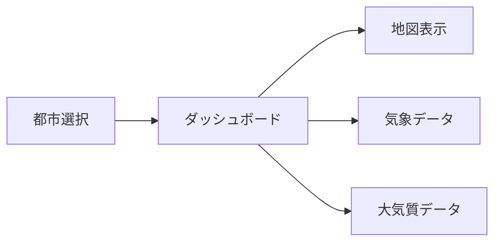
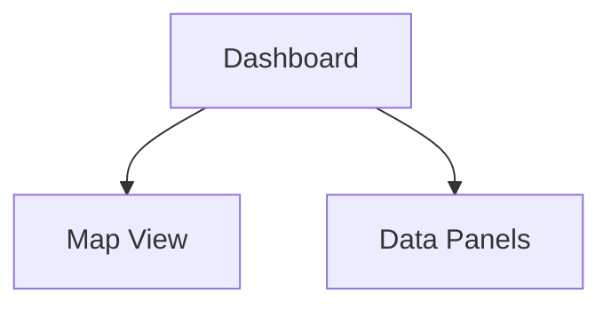
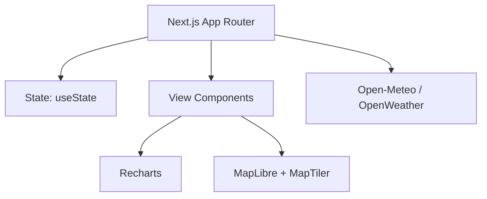

# City Observatory

都市の"いま"を観測するダッシュボード。日本の主要 6 都市の天気・大気質を 1 画面で可視化するフロントエンド専用アプリです。

## 目的

- 私自身がよく散歩をするので、天気や大気質の情報を瞬時に把握したいと思い作成しました。

## コンセプトと構成



## 主要機能

- 6 都市（東京/大阪/名古屋/札幌/福岡/那覇）の切り替え
- 地図のズーム・パン・降水レイヤー切替
- 現在値と 24h/7d（AQ は 24h/5d）の時系列表示
- ダークモード切替

## 画面構成



## アーキテクチャ概要



## ドキュメント

- `docs/requirements.md` 要件定義
- `docs/technical-specifications.md` 技術仕様
- `docs/coding-guidelines.md` コーディング規約

## 開発フロー（Issue駆動）

- ブランチ命名: `issue-<number>-<slug>`（例: `issue-10-map-view`）
- PRタイトル: `Issue #<number>: <短いタイトル>`
- PR本文: `Closes #<number>`
- 推奨コマンド:
  - `gh issue develop <number> -b issue-<number>-<slug>`
  - `gh pr create -t "Issue #<number>: <title>" -b "Closes #<number>"`

## 開発コマンド

```bash
pnpm dev
pnpm build
pnpm start
pnpm lint
```

## 環境変数

`.env.local` / `.env.production` に設定（キーはGitにコミットしない）

```bash
NEXT_PUBLIC_MAPTILER_KEY=
NEXT_PUBLIC_OPENWEATHER_KEY=
NEXT_PUBLIC_MAP_STYLE_LIGHT=https://api.maptiler.com/maps/streets-v2/style.json
NEXT_PUBLIC_MAP_STYLE_DARK=https://api.maptiler.com/maps/streets-v2-dark/style.json
NEXT_PUBLIC_DEFAULT_CITY=tokyo
NEXT_PUBLIC_FEATURE_MAP=true
```
